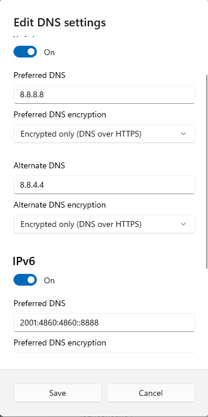

DNS Security

To enable dns over https do following.

Settings -> Network & internet -> Hardware Properties

Edit DNS Settings. Change automatic to manual
Set the dns servers manual, and change the Preferred dns encryption for each of them  

**IPv4 Dns servers**  
Google DNS Primary: 8.8.8.8  
Google DNS Secondary: 8.8.4.4  
Cloudflare DNS Primary: 1.1.1.1  
Cloudflare DNS Secondary: 1.0.0.1  
Quad9 DNS Primary: 9.9.9.9  
Quad9 DNS Secondary: 149.112.112.112  

**IPv6**  
 Google DNS Primary: 2001:4860:4860::8888  
Google DNS Secondary: 2001:4860:4860::8844  
Cloudflare DNS Primary: 2606:4700:4700::1111  
Cloudflare DNS Secondary: 2606:4700:4700::1001  
Quad9 DNS Primary: 2620:fe::fe  
Quad9 DNS Secondary: 2620:fe::fe:9

ex:  
    
---  
This options overwrites dns set per connection in WIFI.